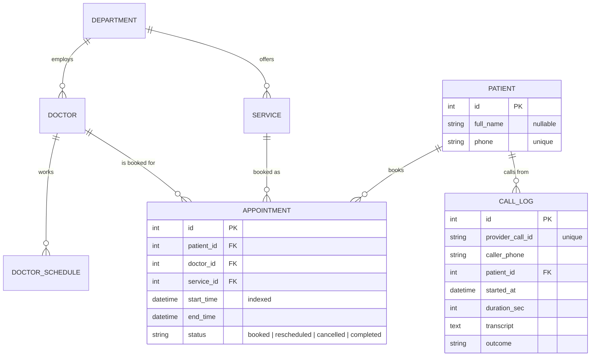

# VoiceBook AI: Entity Relationship Diagram

```mermaid
erDiagram
    DEPARTMENT ||--o{ DOCTOR : employs
    DEPARTMENT ||--o{ SERVICE : offers
    DOCTOR ||--o{ DOCTOR_SCHEDULE : works
    DOCTOR ||--o{ APPOINTMENT : "is booked for"
    SERVICE ||--o{ APPOINTMENT : "booked as"
    PATIENT ||--o{ APPOINTMENT : books
    PATIENT ||--o{ CALL_LOG : "calls from"

    APPOINTMENT {
        int id PK
        int patient_id FK
        int doctor_id FK
        int service_id FK
        datetime start_time "indexed"
        datetime end_time
        string status "booked | rescheduled | cancelled | completed"
    }
    PATIENT {
        int id PK
        string full_name "nullable"
        string phone "unique"
    }
    CALL_LOG {
        int id PK
        string provider_call_id "unique"
        string caller_phone
        int patient_id FK
        datetime started_at
        int duration_sec
        text transcript
        string outcome
    }
```

Available slots are computed from DOCTOR_SCHEDULE minus active APPOINTMENTs, so they are not stored in a separate table.